# Prereq

Do you really need to unbrick your keyboard?

**This guide will only help if the orange flashing LED will not activate even after pressing the flash button.**

## Supported boards

Keyboards with sam4s based chips

- Kira
- RE:Type
- Gemini Dawn / Dusk

## Erasing

!> This procedure has the posiblity of leaving your keyboard in a bad state if you do not complete all steps.
**Proceed at your own caution!**

 - Begin by making sure your keyboard is plugged in to power.
 - Using tweezers or another metal object to touch the two erase pads together for 30 seconds.

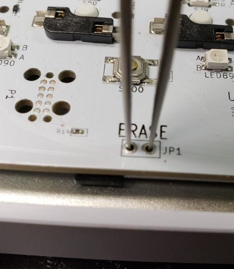

 - Unplug the keyboard and plug it back in.

## Detecting the device

The flash mode led should be a faint orange at this point.

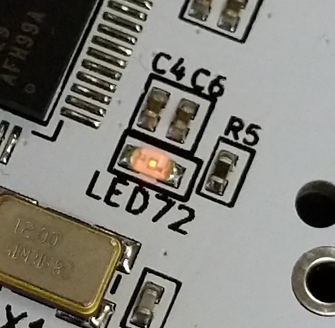

You can confirm the keyboard is detected by following the steps for your system below.

<!-- tabs:start -->

#### ** Windows **

On windows `Device Manager` will show a bossa com port

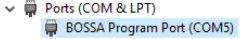

#### ** Mac **

On Mac `System Information` should show an "Communication Device" made by Atmel under USB -> USB Bus.

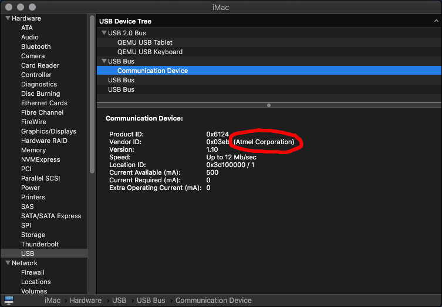

#### ** Linux **

On linux `lsusb` should show a device called "SAMBA bootloader"

`Bus 003 Device 017: ID 03eb:6124 Atmel Corp. at91sam SAMBA bootloader`

<!-- tabs:end -->

## Installing BOSSA

<!-- tabs:start -->

#### ** Windows **

 - Download the latest BOSSA msi from https://github.com/kiibohd/BOSSA/releases/latest

 - Follow the install wizard.

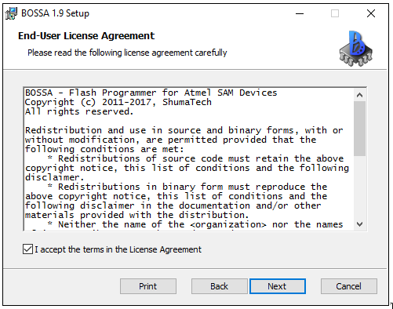

#### ** Mac **

 - Download the latest BOSSA dmg from https://github.com/shumatech/BOSSA/releases/latest

 - Follow the install wizard.

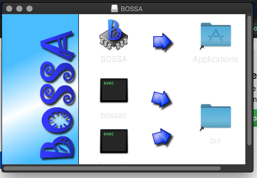

 - Launch the BOSSA application

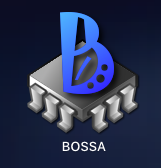

#### ** Linux **

 - Install the ['bossa'](https://aur.archlinux.org/packages/bossa/) aur package.

 - Run `sudo bossa` from a terminal.

<!-- tabs:end -->

## Flashing the bootloader
 - Download the appropriate bootloader.bin file from here:
 [Controller .bin Files](https://github.com/kiibohd/controller/releases)
 - Select the the Serial Port.

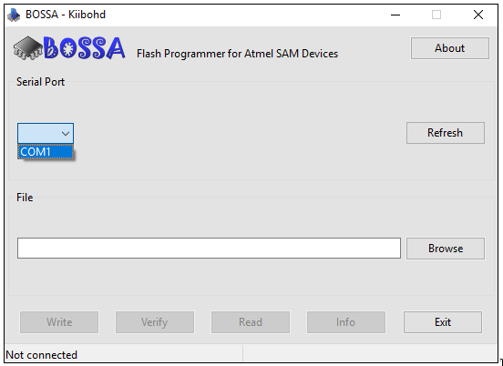

 - Press Browse

 - Select the `kiibohd_bootloader.bin` file and press Open.

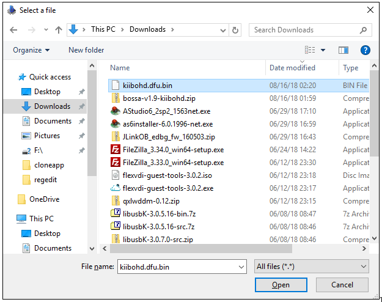

If an error pops up, press "Continue"

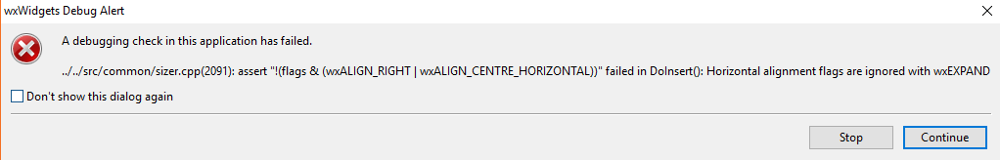

 - Wait for the programming to complete

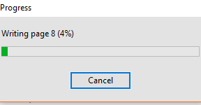

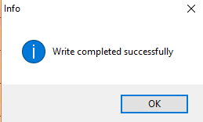

 - Unplug and replug in your keyboard

## Flashing the firmware

The flashing led should be lit brightly.

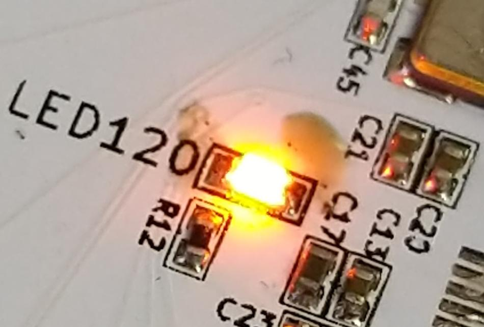

You can now follow the [Quickstart](Quickstart.md) guide to flash your keyboard with the Configurator.
