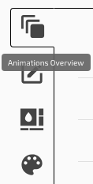
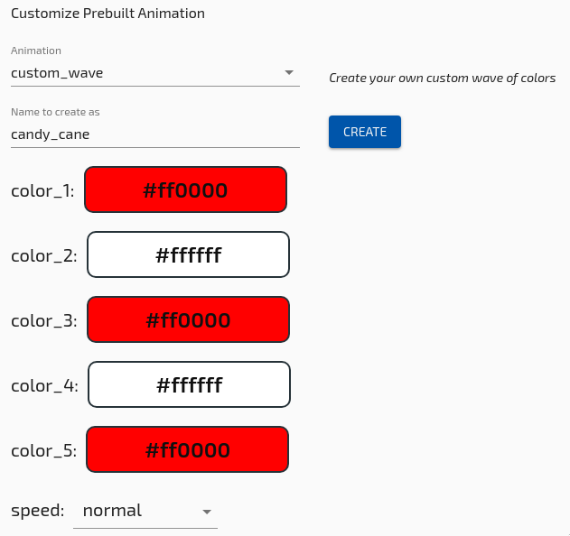

# Steps 
1. Select your active keyboard from the list of connected devices.

2. Select the Visuals tab in the upper right side of the configurator window.

3. Click on the wrench in the bottom left of the configurator window to access the "Customize Pre-built" section.

Select a Pre-built animation from the list, we will use Miami Wave as an example for this manual.

5. Change tne name, speed, and other settings as you see fit, then Click the "Add Animation" button.

6. You should see your new animation and you will need to set it to "Auto-Start". Make sure to turn off any other animations from "Auto-Start" or your desired animation may be overwritten.

?> Follow the [Quickstart guide](Quickstart.md) to load the new configuration to your keyboard.

## Multiple Animations

Some animations can be applied ontop of other animations.
For instance, changing the changing the color of pressed keys.

You can repeat the above process to add more animations. Just make sure to only have one enabled at start.

See [Animation Control](Configurator/Keys.md#animation-controls) for how to start or stop an animation with a key.
