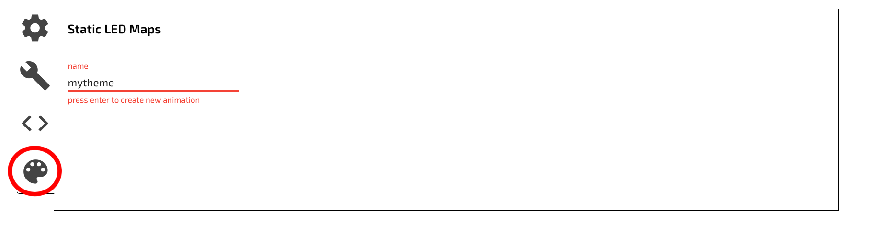
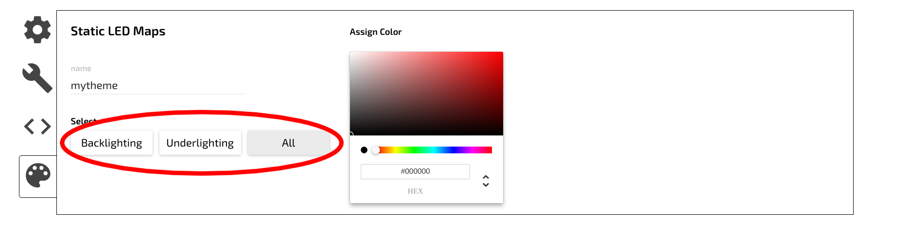
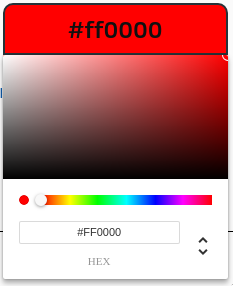
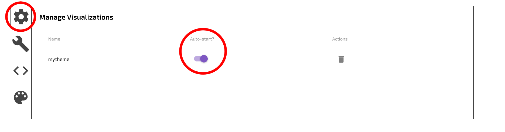

!> Not yet implemented in the new configurator

# Steps
1. Select your active keyboard from the list of connected devices.

2. Select the Visuals tab in the upper right side of the configurator window.

3. Click on the art palette in the bottom left of the configurator window to access the "Static LED Maps" section.

Name your LED Map something without spaces or punctuation and press enter.

4. You can select the LEDs you want to program individually by clicking on the black bracket over each key, or in bulk by using the Backlighting, Underlighting or All buttons.

5. Choose the color you want
 

?> Steps 4&5 can be repeated to change the color of other leds

6. Navigate to the gear section named "Manage Visualizations".
 
You should see your new animation and you will need to set it to "Auto-Start". Make sure to turn off any other animations from "Auto-Start" or your desired animation may be overwritten.

7. Done!

?> Follow the [Quickstart guide](Quickstart.md) to load the new configuration to your keyboard.
