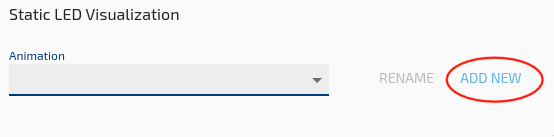
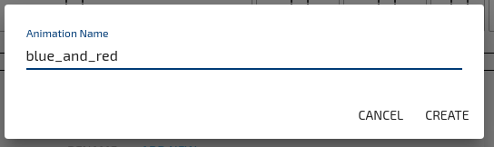
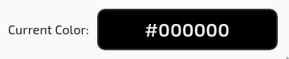
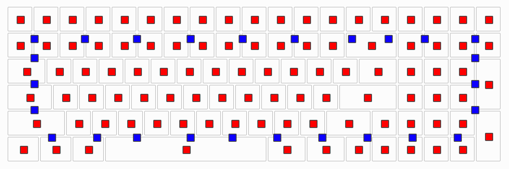

<!--  -->

# Steps
1. Select your active keyboard from the list of connected devices.

2. Click the "Show Visuals" button in the upper right side of the configurator window.

3. Click on the art palette in the bottom left of the configurator window to access the "Static LED Maps" section.

4. Click "Add New"

5. Name your LED Map something without spaces or punctuation and press enter.

4. You can select the LEDs you want to program individually by clicking on the black bracket over each key, or in bulk by using the Backlighting, Underlighting or All buttons.

5. Choose the color you want
 

6. The preview at the top should update with your chosed colors

?> Steps 4&5 can be repeated to change the color of other leds

6. Navigate to the "Animations Overview" tab.

 
7. You should see your new animation and you will need to set it as a "Startup Animation". Make sure to turn off any other animations or your desired lighting may be overwritten.

8. Done!

?> Follow the [Quickstart guide](Quickstart.md) to load the new configuration to your keyboard.
