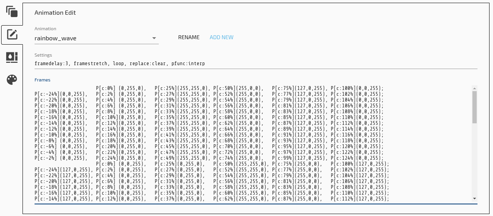

# Steps 
1. Select your active keyboard from the list of connected devices.

2. Select the Visuals tab in the upper right side of the configurator window.

3. Click on the wrench in the bottom left of the configurator window to access the "Customize Pre-built" section.

4. TODO.  For now read the [kll section](Kll.md)
