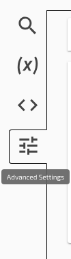
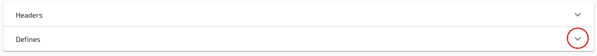
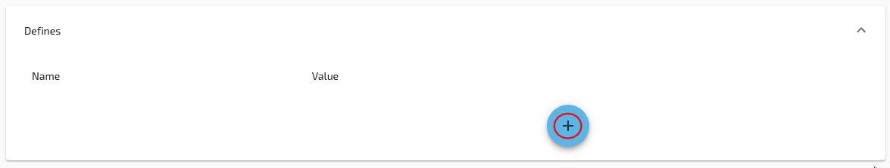
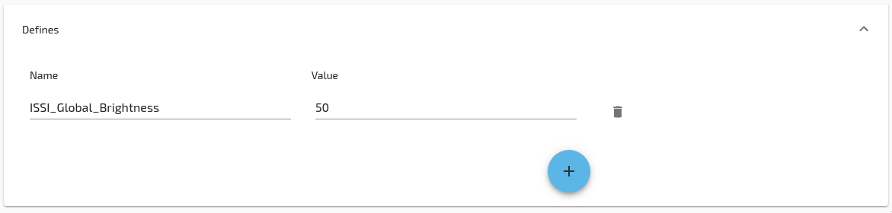

1. Go to the advanced tab

2. Open the defines section

3. Add a new define

4. Enter the name and value

## Useful defines

| Name | Default Value | Use |
|--------|---------|-----|
| ISSI_Global_Brightness | 255 | LED Brightness (0-255) |
| ISSI_Enable | 1 | Enable (1) / Disable (0) LEDs by default. Can use LED Toggle key to change at runtime. |
| LEDGamma | 2.2 | Color correction curve |
| gamma_enabled | 0 | Use gamma correction. Off (0) / On (1) |
| usbProtocol | 1 | Default keyboard mode. 6KRO (0) / NKRO (1) |
| ISSI_FrameRate_ms | 10 | Interval between led updates |
| MinDebounceTime | 6 | Increase for bad switches |
| STLcdBacklightRed | 0x0FFF | Ergodox screen color (Red component) |
| STLcdBacklightGreen | 0x0FFF | Ergodox screen color (Green component) |
| STLcdBacklightBlue | 0x0FFF | Ergodox screen color (Blue component) |

<!--
Flash Size:
latencyResources | 10 | Number of resource allocations for latency measurements
stateWordSize | 16 | Defines available to the PartialMap module
indexWordSize | 16 | 
DelayedCapabilitiesStackSize | 10 | Delayed Capabilities Stack Size
ResultMacroBufferSize | 50 | Ring-buffer size for result macro processing
Pixel_AnimationStackSize | 20 | Animation Stack Size
enableMouse | 1 |
enableVirtualSerialPort | 1
UARTConnectBufSize | 128

Pinout:
ledDebugPin

Debugging:
flashModeEnabled | 0 | Enable resetting to bootloader from cli
-->
