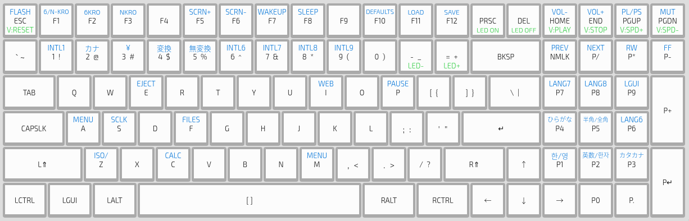
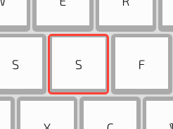
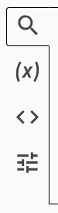
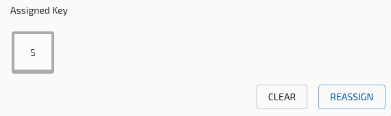
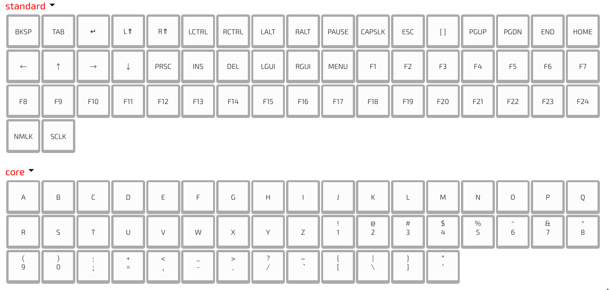
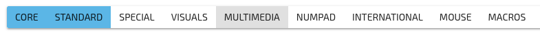
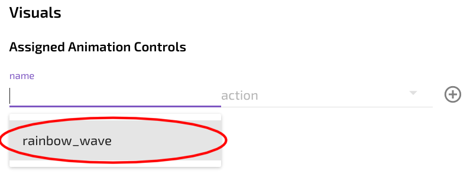
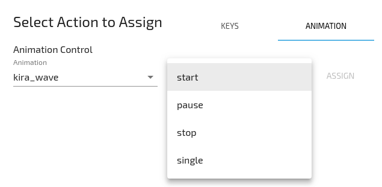

1. Select your active keyboard from the list of connected devices. You should see a preview of the selected board.

2. Select a key, it will be outlined with a red outline

3. Make sure the key info tab is selected

4. Click the reassign button

?> Tip: Holding shift when selecting a key will go straight to the reassign dialog

## Actions

- Select your desired action from the popup (see [Actions](Configurator/Actions.md) for more info).

- Different categories can be shown or hidden by clicking their names in the bar at the top.

- After selecting a key the switch will now be rebound.

- This process can be repeated for any other keys that need to be changed.

**For information on how layers inteact and behave see the [Layers](Configurator/Layers.md) page.**

?> Follow the [Quickstart guide](Quickstart.md) to load the new configuration to your keyboard.

## Animation Controls

- In the key assign dialog, chose the animation tab

- Select an animation 

- Select an action 

- Assign the command 

- The key will now start/stop/pause the chosen animation
