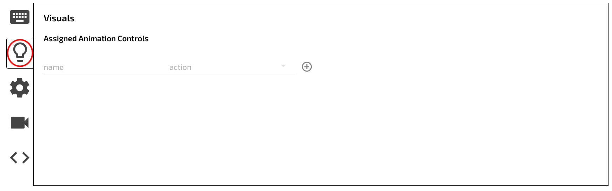

1. Select your active keyboard from the list of connected devices.

2. Select the Keymap tab in the upper right side of the configurator window.

3. Select a key, it will be outlined with a red outline

## Actions

- select your desired action from below

See [Actions](Configurator/Actions.md) for details.

- the key will now be rebound.

This process can be repeated for any other keys that need to be changed.

?> Follow the [Quickstart guide](Quickstart.md) to load the new configuration to your keyboard.

## Animation Controls

!> Not yet implemented in the new configurator

- Select the Visuals tab

- Select an animation 

- Select an action 

- Add the command 

