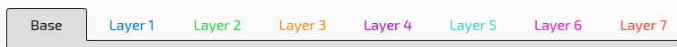
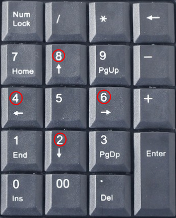
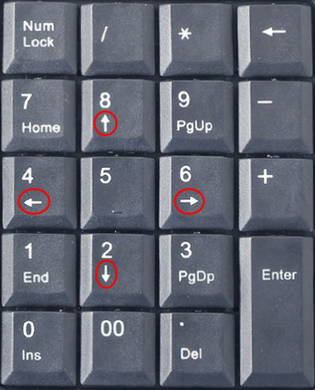
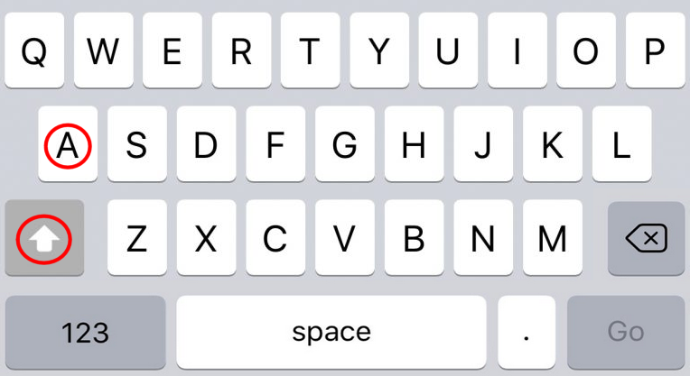

Layers provide a way to to change how keys behave.

You can switch between layers with the bar at the top of the configurator.

## Layers Shifting

Shifting activates a change but only while a key is **held** down.

This is most often seen on laptops. Many laptops have a Fn key that gives two possible actions to the top row.

For instance, normally F1 will behave as a function key (and ex open a help doc).

However, while keeping Fn held down then F5 can act another action such as changing your screen brightness.

Layer shifting allow you to take this concept and apply it to any keys you want.

### An Interactive Example

Here is a normal keyboard

- All keys act as labelled.

- While <kbd>Fn</kbd> is held, layer 1 activates

    - <kbd>PgUp</kbd> becomes <kbd>Vol+</kbd>
    - <kbd>PgDn</kbd> becomes <kbd>Vol-</kbd>

- When <kbd>Fn</kbd> is no longer pressed, layer 1 deactiaves and the keys return to normal

?> Hover over the Fn key to see the layer shift

  Fn
  
  

## Layer Locking

Locking behaves just like num lock. They provide a way to **toggle** a behavior on or off.
When a lock is activated one or more keys stay changed until the lock is deactivated.

Caps lock behaves in much this way. Changing between capital and lowercase letters.

For another example we can look at how a numpad acts.
With num lock enabled all keys on the numpad act as numbers

However, when numlock is disabled then some of the keys act as arrows.

Neither state changes how the symbols behave.

### An Interactive Example

We will once again look at the same basic keyboard.

- All keys act as labelled.

- When <kbd>f1</kbd> is pressed then the orange layer 2 is activated.

    - <kbd>PgUp</kbd> becomes <kbd>LED+</kbd>
    - <kbd>PgDn</kbd> becomes <kbd>LED-</kbd>

- These keys continue to act this way after the <kbd>f1</kbd> key is released.

- Once <kbd>f1</kbd> is pressed again then the layer will deactivate and the normal actions will apply.

?> Click the Fn key to enable or disable the layer lock

<input type="checkbox" class="toggle" id="checkbox"><label for="checkbox" class="btn">Fn</label>
<label for="checkbox" class="image_inactive"></label>
<label for="checkbox" class="image_active"></label>

## Layer Latching

Latching provides an middle ground between shifting and locking.
A latch will activate a function layer but only for the **next** keypress.

Think of the Shift key on a phone keyboard capitalizing the next letter you tap.

## Multiple Layer Interactions

With locks, latches, and shifts it is possible to end up with multiple layers active at the same time.

Each layer builds upon the ones below it applying extra changes ontop, much like in image editors such as Photoshop.

If any key is "clear" then the action from the layer below it will apply.

### An Interactive Example

?> Check or uncheck the layers to see how keys behave 

  
    <input type="checkbox" id="layer1" value="0" onclick="layerState(this, 'layers_preview', 'images/layers_example/')"><label for="layer1" class="btn">Layer 1</label>
    <input type="checkbox" id="layer2" value="1" onclick="layerState(this, 'layers_preview', 'images/layers_example/')"><label for="layer2" class="btn">Layer 2</label>
  
  

    
      
      <ul>
        <li>
	  <kbd style="color: red">①</kbd> acts as <kbd>PgUp</kbd>
	  <ul>
	    <li>Set by the base layer and not overriden</li>
	  </ul>
        </li>
        <li>
	  <kbd style="color: red">②</kbd> acts as <kbd>Home</kbd>
	  <ul>
	    <li>Set by the base layer and not overriden</li>
	  </ul>
        </li>
	</li>
      </ul>
    
    
      
      <ul>
        <li>
	  <kbd style="color: red">①</kbd> acts as <kbd>Vol+</kbd>
	  <ul>
	    <li>Overriden by layer 1</li>
	  </ul>
        </li>
        <li>
	  <kbd style="color: red">②</kbd> acts as <kbd>Prev</kbd>
	  <ul>
	    <li>Overriden by layer 1</li>
	  </ul>
        </li>
	</li>
      </ul>
    
    
      
      <ul>
        <li>
	  <kbd style="color: red">①</kbd> acts as <kbd>LED+</kbd>
	  <ul>
	    <li>Overriden by layer 2</li>
	  </ul>
        </li>
        <li>
	  <kbd style="color: red">②</kbd> acts as <kbd>Home</kbd>
	  <ul>
	    <li>Set by the base layer and not overriden</li>
	  </ul>
        </li>
	</li>
      </ul>
    
    
      
      <ul>
        <li>
	  <kbd style="color: red">①</kbd> acts as <kbd>LED+</kbd>
	  <ul>
	    <li>Overriden by layer 2</li>
	  </ul>
        </li>
        <li>
	  <kbd style="color: red">②</kbd> acts as <kbd>Prev</kbd>
	  <ul>
	    <li>Set by layer 1 (and not overriden by layer 2)</li>
	  </ul>
        </li>
	</li>
      </ul>
    
  

### Videos

