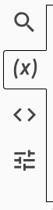
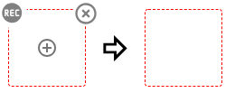
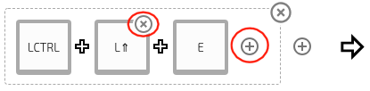
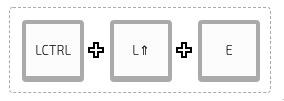

# Steps 
1. Select your active keyboard from the list of connected devices.

2. Select the Macros tab

3. Press the add button

4. When hovering over the trigger you will see the following

5. Pressing "REC" will allow you to record a macro

6. Click the key on the other side of the arrow to determine what the macro will do

7. Keys can later be editted or removed if need be

# Types of Macros

## Combination

A plus means all keys must be pressed at the same time.

For example, holding Ctrl+Shift then pressing E at the same time could trigger an action

## Sequential

A comma means that each action must be done in order.

For example, typing /, then typing U, then typing P could trigger an action (for instance increasing the brightness) 

