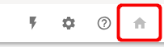
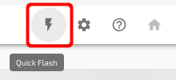
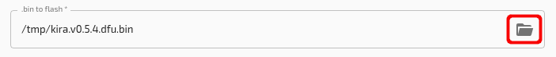
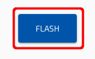

1. Make sure you're at the home screen.

2. You know you're at the home screen if the house icon is greyed out.

3. Click on the Quick Flash button.

4. Select which `.dfu.bin` file to flash. In most cases you can find them on the [controller releases page](https://github.com/kiibohd/controller/releases).

5. Put keyboard into flash mode. This is usually done by either pressing the flash mode key combination or by pressing the reset button on the bottom of your keyboard.

6. Once the keyboard is in flash mode, press the Flash button.

