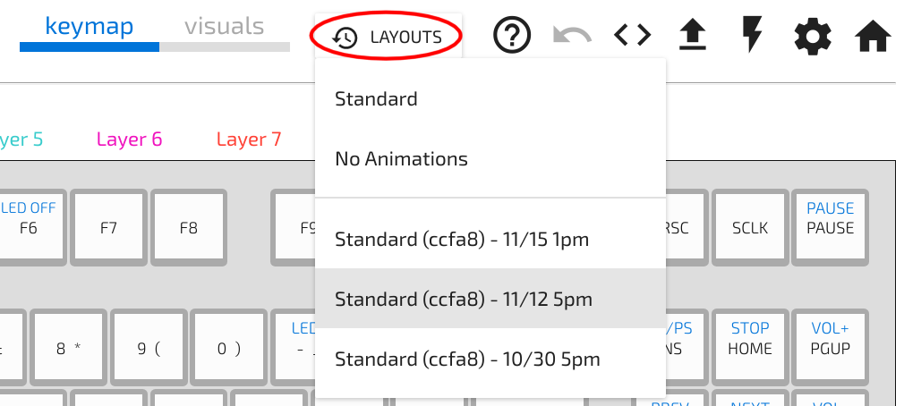

## Autosave

Every build is automatically saved.

The "Layous" button on the top can be used to revert to one of these previous builds

?> Follow the [Quickstart guide](Quickstart.md) to load the new configuration to your keyboard.
