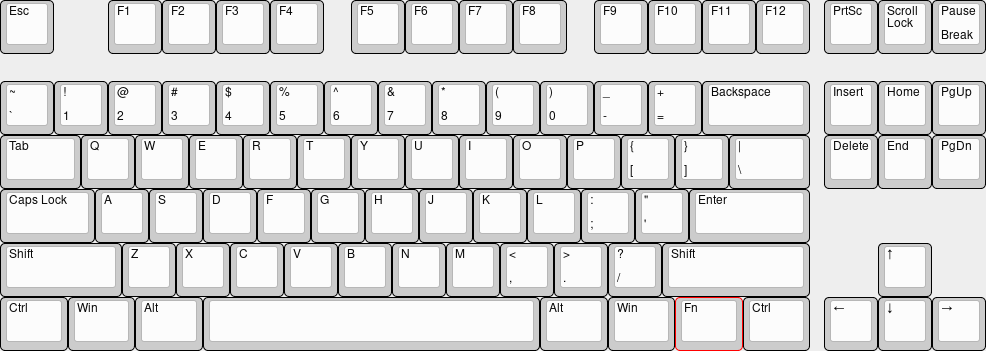

## Flashing

Please download the appropriate Hexgears Configurator for your operating system:  
[Hexgears Configurator Releases](https://github.com/hexgears/configurator/releases/latest)

Then please follow the [Quickstart guide](Quickstart.md). Instructions for both the Hexgears and IC configurator apply the same.

## Layout

### Base Layer

### Layer 1
Layer 1 is accessible with by holding the Fn key.

### Layer 2
Layer 2 is accessible with by holding Fn and right shift.

[hotswap](../Hotswap.md ':include')

## Unbricking

Please follow the [Unbrick guide](../BOSSA.md).
