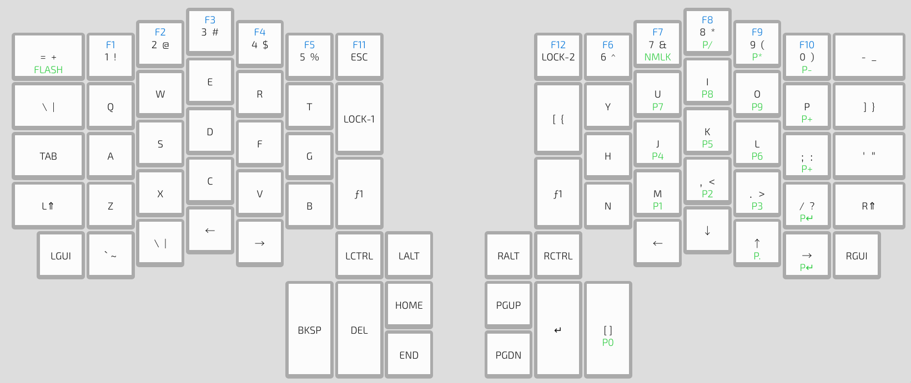

## Flashing

Please follow the [Quickstart](Quickstart.md) guide.

Please note that you might need to flash two sides separately, as Ergodox is a split keyboard. One stable way of flashing is, follow the quickstart guide until Flashing, then

1. Connect one of the keyboards to the computer and disconnect the other one
2. Hit the button on the back of the PCB, opposite to the f1 key to enter flashing mode. The display and another LED on the back of the PCB will turn red, similar to Whitefox/Nightfox or K-Type from the guide.
3. Hit Download Firmware and Flash from the configurator. Once finished, the display will return to normal display and the LED on the back of the PCB will go off, indicating it's out of the flashing mode.
4. Disconnect this keyboard, connect the other to the computer and repeat the above steps.

## Assembling a kit

https://input.club/devices/infinity-ergodox/infinity-ergodox-build-guide/

## Layout

## Resources

### Case Files

https://github.com/kiibohd/case/tree/master/infinity-ergodox

### PCB Files

[Left Half](https://github.com/kiibohd/pcb/tree/master/ICED%20-%20Left)

[Right Half](https://github.com/kiibohd/pcb/tree/master/ICED%20-%20Right)
