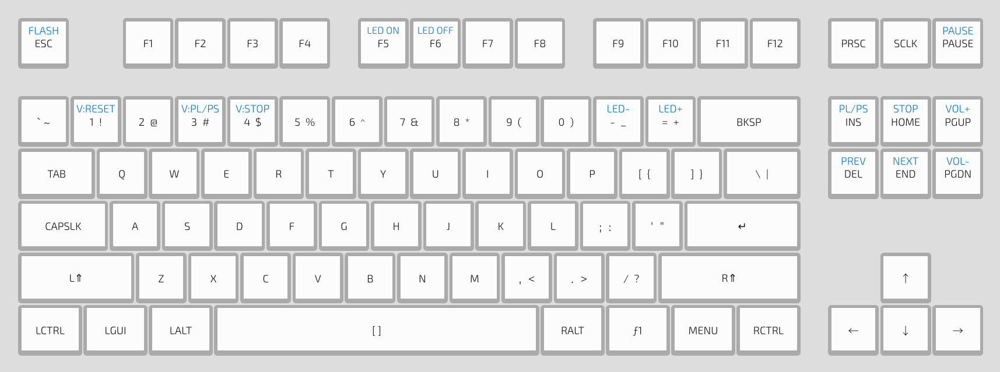

## Flashing

Please follow the [Quickstart](Quickstart.md) guide.

## Layout

[hotswap](../Hotswap.md ':include')

## Changing the stabilizers

## Resources

### Case Files

https://github.com/kiibohd/case/tree/master/K-Type

### PCB Files

https://github.com/kiibohd/pcb/tree/master/K-Type
