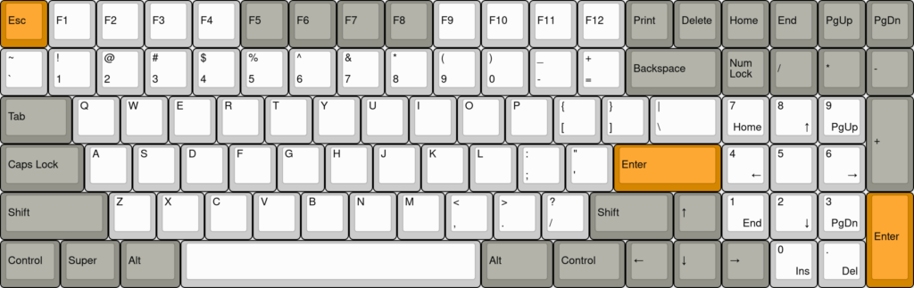
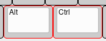
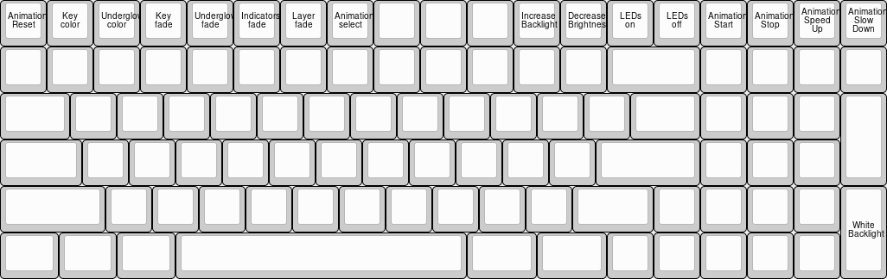
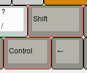
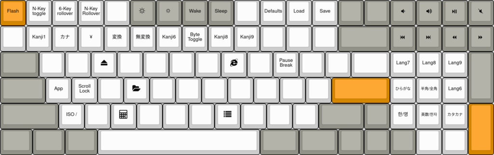

## Firmware Update

?> **We recommend all customers to update their keyboard for the latest fixes and features.**  
   You can either use the installer below, or use the [Configurator](Quickstart.md)

<!-- tabs:start -->

#### ** Windows **

- Install the [Windows Drivers](https://github.com/kiibohd/kiidrv/releases/download/v1.5.3-kiidrv/KiibohdDrivers.msi) (Necessary to flash properly.)

- Run the [Firmware Updater](https://github.com/kiibohd/kiidrv/releases/download/v1.5.3-kiidrv/kira-firmware-v0.5.3-installer.exe)

- Enter flash mode by pressing <kbd>Right Shift</kbd> + <kbd>Right Control</kbd> + <kbd>Esc</kbd>,
  or by pressing the reset button on the bottom of the board

Once in flash mode the orange led should be lit.

#### ** Mac **

- Run the [Firmware Updater](https://github.com/kiibohd/kiidrv/releases/download/v1.5.3-kiidrv/KiraFirmwareInstaller.app.zip)

- Enter flash mode by pressing <kbd>Right Shift</kbd> + <kbd>Right Control</kbd> + <kbd>Esc</kbd>,
  or by pressing the reset button on the bottom of the board

Once in flash mode the orange led should be lit.

#### ** Linux **

- Download the [Firmware Updater](https://github.com/kiibohd/kiidrv/releases/download/v1.5.3-kiidrv/kira-firmware-v0.5.3-installer.tar.gz)

- Extract the file

- Run `flash.sh`

- Enter flash mode by pressing <kbd>Right Shift</kbd> + <kbd>Right Control</kbd> + <kbd>Esc</kbd>,
  or by pressing the reset button on the bottom of the board

Once in flash mode the orange led should be lit.

<!-- tabs:end -->

#### Fixed Issues

The following issues are fixed with a firmware update:

- When entering flash mode using the keycombo, the ctrl/shift keys may stay pressed
- The orange fade-in animation may show two different shades

## Customizing

**Configurator now available!**

The [Quickstart guide](Quickstart.md) should help you configure your device

## Default Layout

### Lighting Layer
The Animation layer is accessible with by holding <kbd>Right Alt</kbd> + <kbd>Right Control</kbd>.

| Key Combo | Action |
|-----------|--------|
| <kbd>Right Alt</kbd> + <kbd>Right Control</kbd> + <kbd>F1</kbd> | Change key colors |
| <kbd>Right Alt</kbd> + <kbd>Right Control</kbd> + <kbd>F2</kbd> | Change underglow color |
| <kbd>Right Alt</kbd> + <kbd>Right Control</kbd> + <kbd>F7</kbd> | Change animation |
| <kbd>Right Alt</kbd> + <kbd>Right Control</kbd> + <kbd>-</kbd> | Increase Brightness |
| <kbd>Right Alt</kbd> + <kbd>Right Control</kbd> + <kbd>+</kbd> | Decrease Brightness |

#### Fading

By default the keyboard will gradually "breath" in and out. The speed of this can be changed.

| Key Combo | Action |
|-----------|--------|
| <kbd>Right Alt</kbd> + <kbd>Right Control</kbd> + <kbd>F12</kbd> | Change key fade |
| <kbd>Right Alt</kbd> + <kbd>Right Control</kbd> + <kbd>F11</kbd> | Change underglow fade |

### Control Layer
The Control layer is accessible with by holding <kbd>Right Shift</kbd> + <kbd>Right Control</kbd>.

#### Media Keys

| Key Combo | Action |
|-----------|--------|
| <kbd>Right Shift</kbd> + <kbd>Right Control</kbd> + <kbd>Home</kbd>     | Volume Down |
| <kbd>Right Shift</kbd> + <kbd>Right Control</kbd> + <kbd>End</kbd>      | Volume Up |
| <kbd>Right Shift</kbd> + <kbd>Right Control</kbd> + <kbd>PgUp</kbd>     | Play / Pause |
| <kbd>Right Shift</kbd> + <kbd>Right Control</kbd> + <kbd>PgDn</kbd>     | Mute |
| <kbd>Right Shift</kbd> + <kbd>Right Control</kbd> + <kbd>Num Lock</kbd> | Previous Track |
| <kbd>Right Shift</kbd> + <kbd>Right Control</kbd> + <kbd>Numpad /</kbd> | Next Track |
| <kbd>Right Shift</kbd> + <kbd>Right Control</kbd> + <kbd>Numbad *</kbd> | Rewind |
| <kbd>Right Shift</kbd> + <kbd>Right Control</kbd> + <kbd>Numbad -</kbd> | Fast Forward |

#### Save Lighting Settings

After saving your lighting settings they will automatically take effect when the keyboard is plugged in.

| Key Combo | Action |
|-----------|--------|
| <kbd>Right Shift</kbd> + <kbd>Right Control</kbd> + <kbd>F12</kbd> | Save animation & brightness |
| <kbd>Right Shift</kbd> + <kbd>Right Control</kbd> + <kbd>F11</kbd> | Load saved animation & brightness |
| <kbd>Right Shift</kbd> + <kbd>Right Control</kbd> + <kbd>F10</kbd> | Load default animation & brightness |

## Changing the ring

Easily remove the ring from the Kira by gently lifting from the back until it releases and then the front to remove it entirely.

To replace the ring, gently attach the front and lower the back until it snaps into place.

[hotswap](../Hotswap.md ':include')

## Default Animations

| Animation |
|-------|
| Miami Wave |
| Rainbow Wave |
| Pastel Rainbow |
| Kira Wave |
| Orange |

## Default Colors

| Color |
|-------|
| <kbd class="color" data-color="#C12D1D"></kbd> Blood Orange |
| <kbd class="color" data-color="#EE6D28"></kbd> Peach |
| <kbd class="color" data-color="#E09E3B"></kbd> Cream |
| <kbd class="color" data-color="#E5C943"></kbd> Beige |
| <kbd class="color" data-color="#1EB8CD"></kbd> Cyan |
| <kbd class="color" data-color="#00B3A6"></kbd> Teal |
| <kbd class="color" data-color="#2082C6"></kbd> Blue |
| <kbd class="color" data-color="#4354C1"></kbd> Indigo |
| <kbd class="color" data-color="#711C9E"></kbd> Purple |
| <kbd class="color" data-color="#CD3B70"></kbd> Violet |
| <kbd class="color" data-color="#B8343E"></kbd> Salmon |
| <kbd class="color" data-color="#28FF28"></kbd> Pastel Green |
| <kbd class="color" data-color="#FFFF28"></kbd> Pastel Yellow |
| <kbd class="color" data-color="#FF2828"></kbd> Pastel Red |
| <kbd class="color" data-color="#7F28FF"></kbd> Pastel Purple |
| <kbd class="color" data-color="#2828FF"></kbd> Pastel Blue |
| <kbd class="color" data-color="#FF5000"></kbd> Kira Orange |
| <kbd class="color" data-color="#EF0A81"></kbd> Kira Pink |
| <kbd class="color" data-color="#810AEF"></kbd> Kira Purple |
| <kbd class="color" data-color="#0A3CFF"></kbd> Kira Blue |

## Unbricking

Please follow the [Unbrick guide](./BOSSA.md).

## Known Issues

- Some leds occasionally freeze if the led controller chip misbehaves
 - Unplugging and replugging the keyboard should fix the animations

- When using the developer debug terminal leds may flicker
 - No current solution

## Resources

### Case Files

To be released after shipping

### PCB Files

To be released after shipping

### Firmware

https://github.com/kiibohd/controller/tree/master/Keyboards
