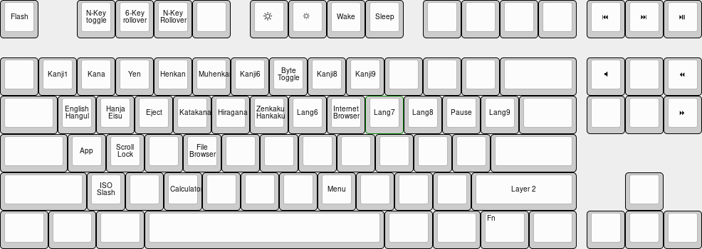
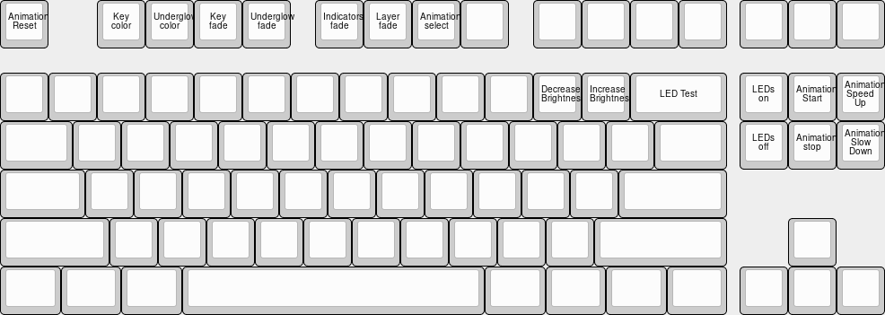

## Flashing

Please follow the [Quickstart](Quickstart.md) guide.

## Layout

### Base Layer

### Layer 1
Layer 1 is accessible with by holding the <kbd>Fn</kbd> key.

### Layer 2
Layer 2 is accessible with by holding <kbd>Fn</kbd> + <kbd>Right Shift</kbd>

[hotswap](../Hotswap.md ':include')

## Unbricking

Please follow the [Unbrick guide](../BOSSA.md).

## Resources

### Case Files

To be released after shipping

### PCB Files

To be released after shipping
