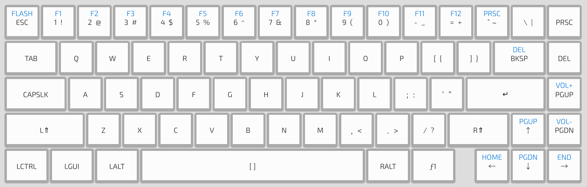
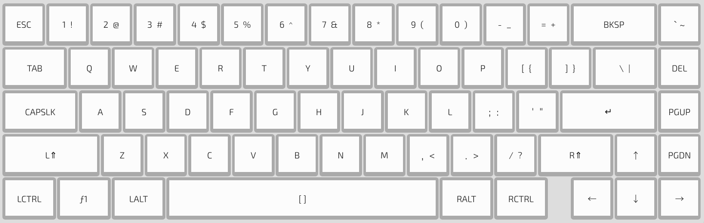
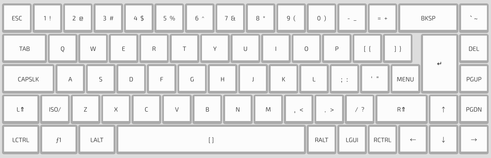
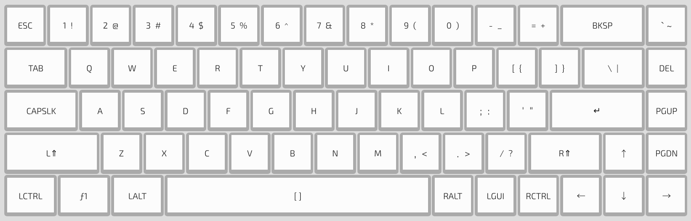
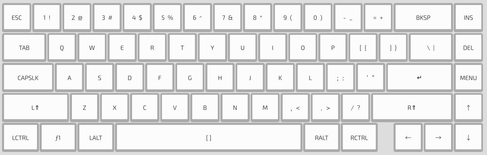
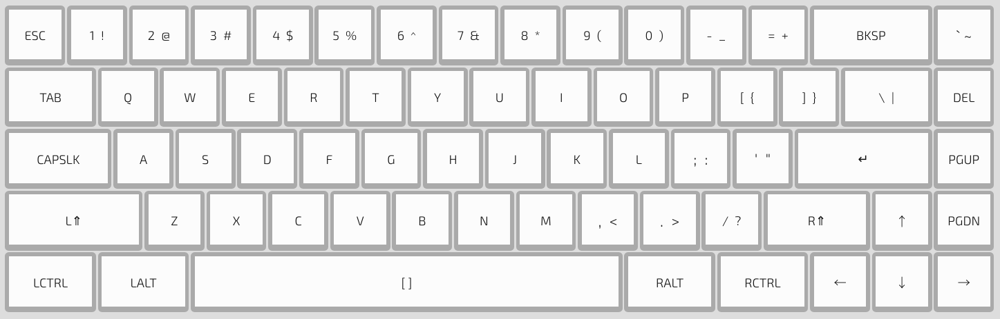

## Flashing the WhiteFox (or NightFox)

Please follow the [Quickstart](Quickstart.md) guide.

## Assembling a kit

[Recommended Soldering Products](https://input.club/recommended-soldering-products/)

### Part 1 - Build

### Part 2 - Soldering

### Part 3 - LEDs

## Layout

<!-- tabs:start -->

#### ** True Fox **

#### ** Aria **

#### ** Iso **

#### ** Vanilla **

#### ** Jack of All Trades **

#### ** Winkeyless **

<!-- tabs:end -->

## Resources

### Case Files

https://github.com/kiibohd/case/tree/master/whitefox-keyboard

### PCB Files

https://github.com/kiibohd/pcb/tree/master/WhiteFox
