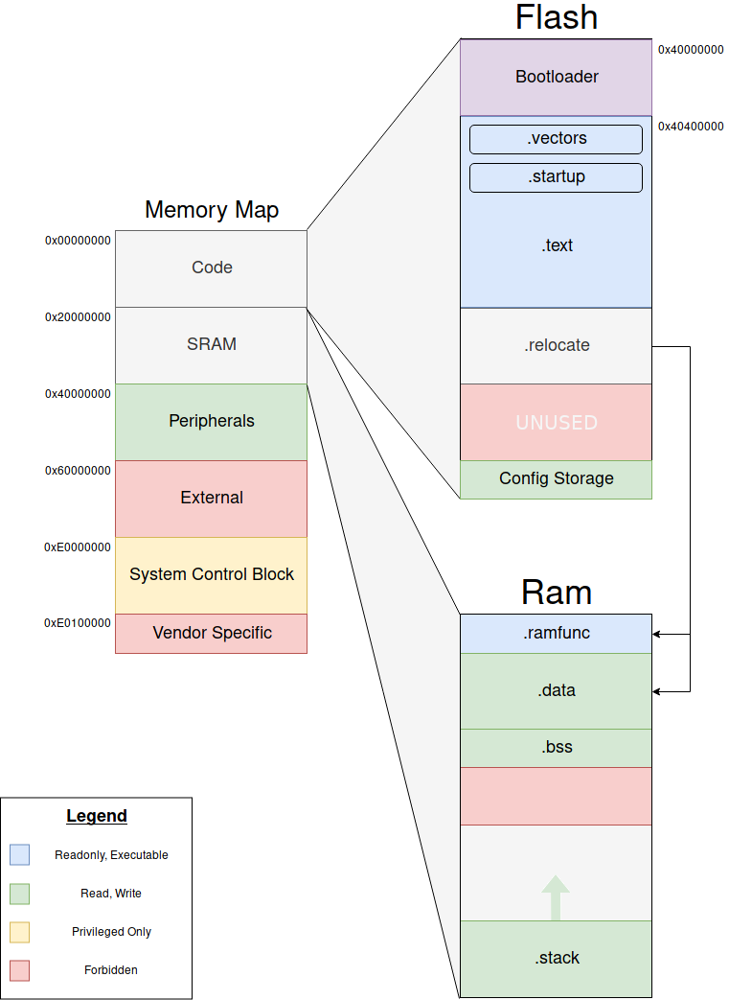

## Initialization

### .vectors

On boot the VTOR (Vector Table offset register) is set to the start of `.vectors`

### .relocate

On boot `.relocate` is copied into `.ramfunc` and `.data`

### .bss

On boot `.bss` is initiailized to all 0's.
All unitialized global variables are stored here.

### .stack

On boot the stack is filled with 0xDEADBEEF, and the MSP (Master Stack Pointer) is set to the start of `.stack`.

### Everything else

All other RAM is unitialized and its contants random per reset. Unused Flash is marked as inaccessible.

## Security

The MPU (Memory Protection Unit) enforeces the permissions described in the Legend.
