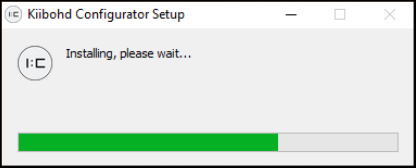
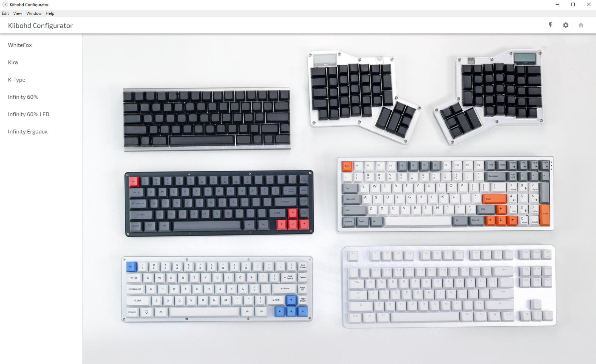
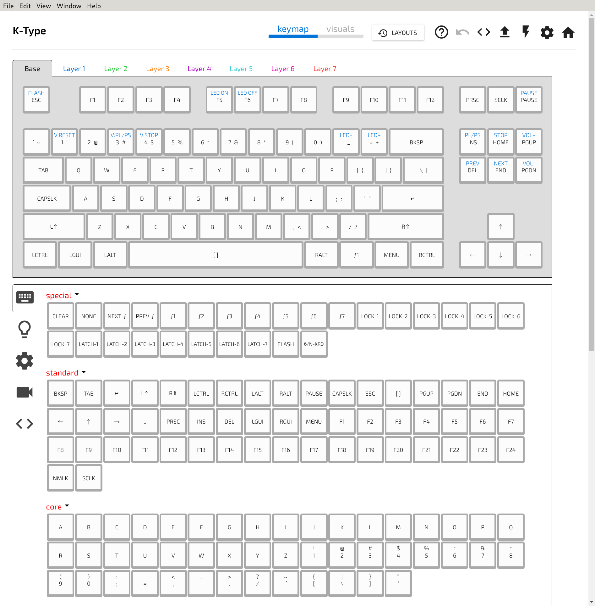
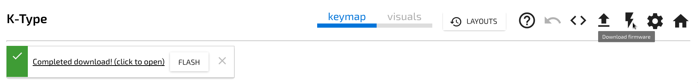
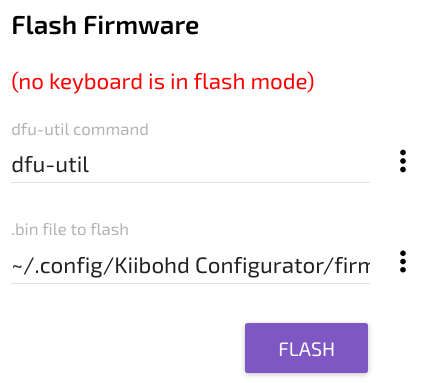

# Install the drivers

<!-- tabs:start -->

#### ** Windows **

 - Unplug your keyboard

 - Download and run:

[Windows Driver Installer](https://github.com/kiibohd/kiidrv/releases/download/v1.5.3-kiidrv/KiibohdDrivers.msi) (Necessary to flash properly.)

 - Plug back in your keyboard

#### ** Mac **

*Nothing to do.*

#### ** Debian, Ubuntu, Mint **

Run the following command in a terminal:

 - `sudo apt-get install dfu-util`

#### ** Fedora **

Run the following command in a terminal:

 - `sudo dnf install dfu-util`

#### ** Arch **

Run the following command in a terminal:

 - `sudo pacman -S dfu-util`

#### ** Other Linux **

Install [dfu-util](http://dfu-util.sourceforge.net) using your systems package manager

<!-- tabs:end -->

# Download the configurator

<!-- tabs:start -->

#### ** Windows **

v1.0.0 **NEW**: [Download Windows Configurator](https://github.com/kiibohd/configurator/releases/download/v1.0.0/kiibohd-configurator-1.0.0-win.exe)

 - Kira support
 - Macro support

#### ** Mac **

v1.0.0 **NEW**: [Download OSX App](https://github.com/kiibohd/configurator/releases/download/v1.0.0/kiibohd-configurator-1.0.0-mac.dmg)

 - Kira support
 - Macro support

#### ** Debian, Ubuntu, Mint **

v1.0.0 **NEW**: [Download AppImage](https://github.com/kiibohd/configurator/releases/download/v0.4.1/kiibohd-configurator-0.4.1.tar.g://github.com/kiibohd/configurator/releases/download/v1.0.0/kiibohd-configurator-1.0.0-linux-x86_64.AppImage)
 - Run the file

#### ** Fedora **

v1.0.0 **NEW**: [Download AppImage](https://github.com/kiibohd/configurator/releases/download/v0.4.1/kiibohd-configurator-0.4.1.tar.g://github.com/kiibohd/configurator/releases/download/v1.0.0/kiibohd-configurator-1.0.0-linux-x86_64.AppImage)
 - Run the file

#### ** Arch **

v1.0.0 **NEW**:
 - [Download AppImage](https://github.com/kiibohd/configurator/releases/download/v0.4.1/kiibohd-configurator-0.4.1.tar.g://github.com/kiibohd/configurator/releases/download/v1.0.0/kiibohd-configurator-1.0.0-linux-x86_64.AppImage)
 - `chmod +x kiibohd-configurator-1.0.0-linux-x86_64.AppImage`
 - `./kiibohd-configurator-1.0.0-linux-x86_64.AppImage`

#### ** Other Linux **

v1.0.0 **NEW**:
 - [Download tar](https://github.com/kiibohd/configurator/releases/download/v1.0.0/kiibohd-configurator-1.0.0-linux-x64.tar.gz)
 - Extract the file
 - Run `kiibohd-configurator`

<!-- tabs:end -->

*Other releases are available on github:* [Browse all](https://github.com/kiibohd/configurator/releases)

# Choose your device

# Configure your Layout

Keys can be reassigned by clicking a switch and then clicking an action below. For more information see the [Keys](Configurator/Keys.md) page.

# Applying your changes

Press the lightning bolt icon at the top right of the toolbar.

Once the download is complete you should see a green success message

### Entering Flash Mode.

<!-- tabs:start -->

## ** Kira **

Pressing <kbd>Right Shift</kbd> + <kbd>Right Control</kbd> + <kbd>Esc</kbd> will enter flash mode.

Alternatively, flip your Kira over find the reset button hole. Press the button with a thin object to put the keyboard into flash mode. You can use this method if your layout does not have a flashing hotkey assigned, or the layout is unknown.

Once in flash mode the orange led should be lit.

## ** WhiteFox / Nightfox **

Pressing <kbd>Fn</kbd> + <kbd>Esc</kbd> will enter flash mode.

#### Fallback Method

1.  Flip your Keyboard over.
2.  With the keys down you should see a small hole on the the buttom of the board.
3.  While the keyboard is plugged in, use a paperclip or other small object to press the button inside the case.

## ** K-Type **

Pressing <kbd>Fn</kbd> + <kbd>Esc</kbd> will enter flash mode.

#### Fallback Method

1.  Flip your Keyboard over.
2.  With the keys down you should see a small hole on the the buttom of the board.
3.  While the keyboard is plugged in, use a paperclip or other small object to press the button inside the case.

<!-- tabs:end -->

### Flashing

Once in flash mode, the red (no keyboard is in flash mode) text should dissapear.
You can then press the purple flash button.

#### Exiting Flash Mode

The keyboard exists flash mode automatically after a successful flash.

If you do not wish to change the firmware you may press <kbd>ESC</kbd> or unplug the keyboard to exit flash mode manually.

# Done

Enjoy your new layout. For more advanced features and configuration please see the [Configurator](Configurator.md#customization) section of this wiki.
