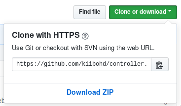

## Recommended

The easiest option is to setup Docker for your computer and works on Windows, Mac, and Linux.
You won't have to worry about having the incorrect package versions by using docker as the Dockerfiles are supported by the developers.

- Clone the project with `git` or by pressing the "Download ZIP" button on [github](https://github.com/kiibohd/controller).

- Follow the Docker guide [HERE](https://github.com/kiibohd/controller/tree/master/Dockerfiles)

## Manual Install

<!-- tabs:start -->

#### ** Windows **

# Windows 10+ - Windows Subsystem for Linux

This is the next easiest option, just follow the instructions for [Ubuntu Linux](https://github.com/kiibohd/controller/wiki/Linux-Setup#ubuntu).

# Windows 10 and Lower - Cygwin (Not Recommended)

Building on Windows should be fine for 99% of users, but takes a bunch of work to setup (because Windows is a crappy dev environment).
Cygwin is currently required along with some non-Cygwin compilers and utilities (because they are not available for Cygwin).
The dfu Bootloader will not build because of a Make 3.81+ bug/feature that removed support for non-Unix (Windows) filenames as dependencies of targets.
If you [replace the version of Make in Cygwin](http://stackoverflow.com/questions/601516/cygwin-make-error-target-pattern-contains-no) it should work.
However, make sure that the flash size is no larger than 4096 Bytes or the bootloader will not work. Things will likely break if there are **SPACES IN YOUR PATHS**. I install cygwin to `C:\cygwin64`.
If you are brave and have programming knowledge, I will accept patches to fix any issues
regarding spaces in paths.

[CLICK HERE](WindowsSetup.md)

#### ** Mac **

[mac](MacSetup.md ':include')

#### ** Linux **

[linux](LinuxSetup.md ':include')

<!-- tabs:end -->
